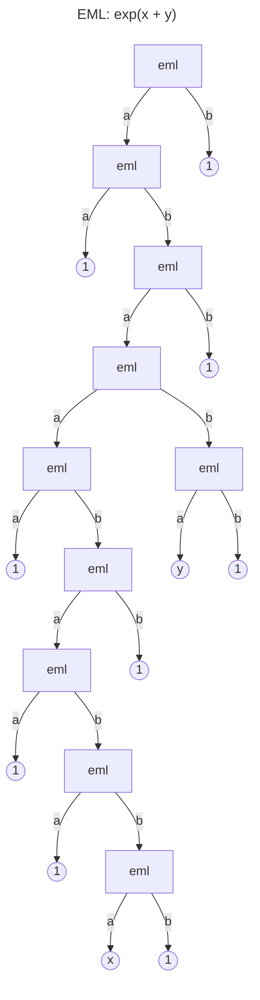

# `eml-skill`

> A programmable intermediate representation and executable verifier for the EML operator introduced by Andrzej Odrzywołek in [arXiv:2603.21852](https://arxiv.org/abs/2603.21852), delivered as five Claude skills and a shared Python core.

[](https://yaniv-golan.github.io/eml-skill/static/install-claude-desktop.html)

[](https://opensource.org/licenses/MIT)
[](https://agentskills.io)
[](https://docs.anthropic.com/en/docs/agents-and-tools/claude-code/plugins)
[](https://cursor.com/docs/plugins)
[](https://github.com/yaniv-golan/skill-creator-plus)
[](https://github.com/yaniv-golan/skill-packager-skill)

[](https://github.com/yaniv-golan/eml-skill/actions/workflows/tests.yml)


Uses the open [Agent Skills](https://agentskills.io) standard. Works with Claude Desktop, Claude Cowork, Claude Code, Codex CLI, Cursor, Windsurf, Manus, ChatGPT, and any other compatible tool.

**Try it**: once the plugin is installed, ask Claude something like _"Is `sqrt(x² + y²) = x + y` a valid identity?"_ — the right skill loads automatically from your prompt, no slash command needed.

## What is EML?

`eml(a, b) = exp(a) − log(b)` on the principal branch (`cmath`). The paper's
claim: every elementary function is a finite tree over `{1, x, y}` leaves
joined by `eml`. This repo treats that claim as a programmable IR —
you can **compile** ordinary math into EML, **verify** any candidate tree
numerically against a named function (with branch-cut probes), **search**
for a shorter tree, **fit** an elementary law from data, or **check** whether
two arbitrary elementary-function expressions are equal.

Throughout this repo, **K** is the tree-size metric: the total number of
nodes in an EML tree, counting every leaf (`1`, `x`, `y`) and every `eml`
operator. It is the same number you get by counting symbols in the tree's
[Reverse Polish notation](https://en.wikipedia.org/wiki/Reverse_Polish_notation)
(RPN) encoding, which is how the paper reports it.

## Relationship to the paper and the proof engine

Three separate artifacts, one maintainer:

- **The paper**, [*All elementary functions from a single binary
  operator*](https://arxiv.org/abs/2603.21852) (arXiv:2603.21852), is by
  **Andrzej Odrzywołek** ([@VA00](https://github.com/VA00) on GitHub).
  It introduces the EML operator and establishes
  calculator-primitive closure, with a compiler-generated witness table
  (Table 4) as evidence. Everything in this repo exists downstream of that
  work — the operator, the two axioms, the closure claim, and the initial
  witness catalog are all his.
- **The [Proof Engine](https://yaniv-golan.github.io/proof-engine/)** is a
  separate, general-purpose open-source project  — an
  [Agent Skills](https://agentskills.io)-compatible AI agent skill that
  forces every factual claim to carry its receipts: computations are done
  by re-runnable Python (so the LLM can't fake them), and citations are
  fetched from the live URL and string-matched against the exact quoted
  text. Its published catalog includes
  the EML identities this repo depends on — the two axioms, EXP,
  triple-nesting LN, K=19 addition, K=17 multiplication, π and i from 1,
  and the apex calculator-closure proof — each shipped as a `proof.py` +
  `proof.md` + audit bundle that anyone can re-execute. 
- **This repo** is the EML-focused executable companion. Each witness in
  the shipped library cites back to the specific Proof Engine proof that
  established it; this repo re-verifies each one numerically at import
  time (principal-branch `cmath` with interior samples and branch-cut
  probes) and then extends the library by searching for shorter trees
  than either the paper's Table 4 or the Proof Engine proofs publish. On
  the scorecard below, 🟡 rows are cases where this repo beats the
  published upper bound; 🔴 rows are where a paper bound was not
  reproducible by any tool here.

The per-primitive proof URLs are cited in
[`eml-skill/skills/_shared/eml_core/witnesses.py`](eml-skill/skills/_shared/eml_core/witnesses.py);
the seven proofs and how they depend on each other are mapped in
[`docs/proof-engine-dag.md`](docs/proof-engine-dag.md).

Here is `exp(x + y)` lowered into a K=21 EML tree (output of `/eml-lab compile-render`):



## Who this is for

- **You have an LLM-generated proof or textbook identity** and want to know whether two closed-form expressions really are equal ([`/math-identity-check`](eml-skill/skills/math-identity-check/SKILL.md)).
- **You have an EML tree** from the paper or the Proof Engine and want an independent numerical audit with branch-cut probes ([`/eml-check`](eml-skill/skills/eml-check/SKILL.md)).
- **You have a sympy expression** and want to lower it into the EML IR, visualize the tree, and emit a shareable artifact bundle ([`/eml-lab`](eml-skill/skills/eml-lab/SKILL.md)).
- **You have a CSV** and want to ask "which elementary law generated this data?" with a machine-checkable JSON answer ([`/eml-fit`](eml-skill/skills/eml-fit/SKILL.md)).
- **You have an EML tree and want a shorter one** — equivalence check, peephole library swap, or beam search ([`/eml-optimize`](eml-skill/skills/eml-optimize/SKILL.md)).

## The five skills

<!-- Keep the example prompts in sync with the description: fields in each SKILL.md -->

Once the plugin is installed, you don't need to type `/eml-check` — describe the task and Claude loads the matching skill from its description field. The prompts below are representative triggers; the full `python` CLI path (for dev / CI / headless use) is consolidated in [Local setup](#local-setup).

### [`/math-identity-check`](eml-skill/skills/math-identity-check/SKILL.md) — verify an arbitrary elementary identity

Two expressions in, one verdict out (`verified`, `refuted`, `branch-dependent`,
`cannot-verify`, or `parse-error`). Handles sympy-parseable Python syntax and
LaTeX; when both sides compile to EML it uses the proof engine, otherwise
falls back to `sympy.lambdify` — either way, refutation returns a concrete
counterexample. Designed for screening LLM-generated math, auditing textbook
steps, or spot-checking symbolic-regression outputs.

**Example prompt**: _"Is `sqrt(x^2 + y^2) = x + y` a valid identity? Give me a counterexample if not."_

<details><summary>Or run the CLI directly</summary>

```bash
python eml-skill/skills/math-identity-check/scripts/check.py \
    --lhs "sqrt(x**2 + y**2)" --rhs "x + y" --out-dir /tmp/out
# → refuted, with a concrete (x, y) counterexample
```
</details>

### [`/eml-check`](eml-skill/skills/eml-check/SKILL.md) — audit a tree against a named claim

Numerical audit with principal-branch `cmath`, interior-domain samplers,
branch-cut probes, and a `--format blog` option that emits a self-contained
markdown artifact suitable for a README, gist, or blog post.

**Example prompt**: _"I got this EML tree from a compiler — does it really compute `ln(x)`? `eml(1, eml(eml(1, x), 1))`"_

<details><summary>Or run the CLI directly</summary>

```bash
python eml-skill/skills/eml-check/scripts/audit.py \
    --tree "eml(1, eml(eml(1, x), 1))" --claim ln --format blog --out-dir /tmp/out
```
</details>

### [`/eml-lab`](eml-skill/skills/eml-lab/SKILL.md) — compile, lookup, inspect, render

Lowers a sympy-parseable expression into an EML tree by substituting library
witnesses, looks up any of the 20 stored primitives, parses arbitrary trees
(nested, RPN, JSON), and with `compile-render` emits a full artifact bundle
(`tree.txt`, `diagram.md`, `audit.json`, `audit.md`, `summary.md`) from one
command.

**Example prompt**: _"Compile `sin(sqrt(x) + cos(x))` into EML and give me the full artifact bundle — tree, Mermaid diagram, numerical audit."_

<details><summary>Or run the CLI directly</summary>

```bash
python eml-skill/skills/eml-lab/scripts/lab.py compile-render \
    --expr "sin(sqrt(x) + cos(x))" --out-dir /tmp/out --domain positive-reals
```
</details>

### [`/eml-optimize`](eml-skill/skills/eml-optimize/SKILL.md) — equivalence, peephole, beam search

Interior + branch-probe equivalence check, bottom-up peephole with library
witness swap, and a beam search with meet-in-the-middle hashing, backward
goal propagation, library-witness seeding, and an optional sympy-simplify
symbolic gate. Results are cross-checked against `/eml-check`'s exhaustive
minimality enumeration.

**Example prompt**: _"Is there a shorter EML tree for subtraction than the current 11-node witness?"_

<details><summary>Or run the CLI directly</summary>

```bash
python eml-skill/skills/eml-optimize/scripts/optimize.py search --target sub --max-k 13
# → K=11 in under a second (matches the shipped witness, minimal by exhaustive enumeration at K≤11)
```
</details>

### [`/eml-fit`](eml-skill/skills/eml-fit/SKILL.md) — library-first regression from CSV

Deterministic witness-library regression — unary, affine `a·w(x)+b` with
constant snapping (π, e, 1/ln(10), Catalan G, …), depth-2 composite `w(v(x))`,
binary `w(x, y)` — emitting a machine-checkable JSON verdict. Not an
LLM-in-the-loop regressor; always returns the same answer for the same CSV.

**Example prompt**: _"Here's a 2-column CSV — which elementary law does it fit best? Try affine mode so it can snap constants like π or e."_

<details><summary>Or run the CLI directly</summary>

```bash
python eml-skill/skills/eml-fit/scripts/fit.py --csv data.csv --affine --top-k 3
```
</details>

## Installation

Installing the **plugin** (Claude Desktop / Claude Code / Cursor marketplace) gives you all five skills at once. Installing a **single skill zip** (ChatGPT, Manus, Claude.ai web) gives you just that one — each per-skill zip ships `_shared/` embedded so it works standalone.

### Claude Desktop

[](https://yaniv-golan.github.io/eml-skill/static/install-claude-desktop.html)

*— or install manually —*

1. Click **Customize** in the sidebar
2. Click **Browse Plugins**
3. Go to the **Personal** tab and click **+**
4. Choose **Add marketplace**
5. Type `yaniv-golan/eml-skill` and click **Sync**

Installing the plugin gets all five skills at once.

### Claude Code (CLI)

From your terminal:

```bash
claude plugin marketplace add https://github.com/yaniv-golan/eml-skill
claude plugin install eml-skill@eml-skill-marketplace
```

Or from within a Claude Code session:

```
/plugin marketplace add yaniv-golan/eml-skill
/plugin install eml-skill@eml-skill-marketplace
```

Installing the plugin gets all five skills at once.

### Cursor

1. Open **Cursor Settings**
2. Paste `https://github.com/yaniv-golan/eml-skill` into the **Search or Paste Link** box

<details>
<summary>Other platforms (Claude.ai web, Manus, ChatGPT, Codex CLI, npx, Windsurf)</summary>

### Claude.ai (Web)

1. Download the skill zip(s) you need from the [latest release](https://github.com/yaniv-golan/eml-skill/releases/latest):
   - [`eml-check.zip`](https://github.com/yaniv-golan/eml-skill/releases/latest/download/eml-check.zip)
   - [`eml-lab.zip`](https://github.com/yaniv-golan/eml-skill/releases/latest/download/eml-lab.zip)
   - [`eml-fit.zip`](https://github.com/yaniv-golan/eml-skill/releases/latest/download/eml-fit.zip)
   - [`eml-optimize.zip`](https://github.com/yaniv-golan/eml-skill/releases/latest/download/eml-optimize.zip)
   - [`math-identity-check.zip`](https://github.com/yaniv-golan/eml-skill/releases/latest/download/math-identity-check.zip)
2. Click **Customize** in the sidebar
3. Go to **Skills** and click **+**
4. Choose **Upload a skill** and upload the zip

### Manus

1. Download the skill zip(s) you want from the [latest release](https://github.com/yaniv-golan/eml-skill/releases/latest)
2. Go to **Settings** → **Skills**
3. Click **+ Add** → **Upload**
4. Upload the zip

### ChatGPT

> **Note:** ChatGPT Skills are currently in beta, available on Business, Enterprise, Edu, Teachers, and Healthcare plans only.
>
> **Warning:** These skills require Python with `sympy` and `numpy`. ChatGPT's sandbox supports Python but `pip install sympy numpy` may not be reliable. If your environment ships those libraries, the skills work as-is; otherwise prefer Claude Desktop, Cursor, or Claude Code.

1. Download the skill zip from the [latest release](https://github.com/yaniv-golan/eml-skill/releases/latest)
2. Upload at [chatgpt.com/skills](https://chatgpt.com/skills)

### Codex CLI

Use the built-in skill installer:

```
$skill-installer https://github.com/yaniv-golan/eml-skill
```

Or install manually:

1. Download a skill zip from the [latest release](https://github.com/yaniv-golan/eml-skill/releases/latest)
2. Extract the skill folder(s) to `~/.codex/skills/`

### Any Agent (npx)

Works with Claude Code, Cursor, Copilot, Windsurf, and [40+ other agents](https://github.com/vercel-labs/skills):

```bash
npx skills add yaniv-golan/eml-skill
```

### Other Tools (Windsurf, etc.)

Download a skill zip from the [latest release](https://github.com/yaniv-golan/eml-skill/releases/latest) and extract the inner skill folder to:

- **Project-level**: `.agents/skills/` in your project root
- **User-level**: `~/.agents/skills/`

</details>

## Local setup

For contributors, CI jobs, or anyone who wants to run the scripts headless without an agent in the loop. Each skill is a thin CLI (`eml-skill/skills/<name>/scripts/`) over the shared core in `eml-skill/skills/_shared/eml_core/`.

```bash
git clone https://github.com/yaniv-golan/eml-skill
cd eml-skill

# minimal runtime
python -m venv .venv && source .venv/bin/activate
pip install -r requirements.txt

# run the full test suite
pip install pytest
PYTHONPATH=eml-skill/skills/_shared pytest eml-skill/skills/_shared/eml_core/tests/ -q

# run the demo notebook
pip install jupyter
jupyter nbconvert --to notebook --execute --inplace docs/demo.ipynb
```

A pre-executed copy of the notebook lives at [`docs/demo.ipynb`](docs/demo.ipynb) —
GitHub renders it inline, including the Mermaid diagrams.

### Invoke the skills as CLIs

All commands assume `cwd` is the repo root. Each skill's `SKILL.md` has the full flag reference.

```bash
# /math-identity-check — numerically audit an arbitrary identity
python eml-skill/skills/math-identity-check/scripts/check.py \
    --left "sqrt(x**2 + y**2)" --right "x + y"

# /eml-check — verify a claimed EML tree against a named reference
python eml-skill/skills/eml-check/scripts/audit.py \
    --tree "eml(1, eml(eml(1, x), 1))" --claim ln

# /eml-lab — compile a sympy expression to EML + emit the artifact bundle
python eml-skill/skills/eml-lab/scripts/lab.py \
    --compile "sin(sqrt(x) + cos(x))" --out-dir out/

# /eml-optimize — search for a shorter EML witness for a named target
python eml-skill/skills/eml-optimize/scripts/optimize.py search \
    --target sub --max-k 13

# /eml-fit — shallow symbolic regression from a 2- or 3-column CSV
python eml-skill/skills/eml-fit/scripts/fit.py \
    --csv data.csv --affine --top-k 3
```

## Scorecard

Compact per-primitive summary. ✅ = proven minimal via exhaustive enumeration;
🟡 = upper bound (a shorter witness may exist); 🔴 = the paper's published K
is not reproducible by any tool in this repo.

The "paper / proof-engine K" column references the upper bounds published in
[arXiv:2603.21852 Table 4](https://arxiv.org/abs/2603.21852) and on the
[proof engine](https://yaniv-golan.github.io/proof-engine/). Many entries
here beat those bounds; the full leaderboard is in [`docs/leaderboard.md`](docs/leaderboard.md).

| primitive | arity | best known K | status | note |
|-----------|:-----:|-------------:|:------:|------|
| `e`       | 0 | 3   | ✅ | axiom [1]: `eml(1, 1) = e` |
| `exp`     | 1 | 3   | ✅ | axiom [2]: `eml(x, 1) = exp(x)` |
| `ln`      | 1 | 7   | 🟡 | triple-nesting identity; principal branch |
| `add`     | 2 | 19  | ✅ | exhaustively minimal on positive reals |
| `mult`    | 2 | 17  | ✅ | proven minimal; removable singularity at `xy = 0` |
| `sub`     | 2 | 11  | ✅ | minimal by exhaustive enumeration at K≤11 |
| `div`     | 2 | 33  | 🟡 | `x · inv(y)` — beats paper K=73 |
| `pow`     | 2 | 25  | 🟡 | `exp(y·ln(x))` |
| `neg`     | 1 | 17  | 🔴 | paper K=15 not reproducible — [refutation](docs/refutation-neg-inv-k15.md) |
| `inv`     | 1 | 17  | 🔴 | paper K=15 not reproducible — [refutation](docs/refutation-neg-inv-k15.md) |
| `sqrt`    | 1 | 59  | 🟡 | `exp(½·ln(x))` |
| `sin`     | 1 | 399 | 🟡 | `(exp(ix)−exp(−ix))·inv(2i)` — beats paper K=471 |
| `cos`     | 1 | 301 | 🟡 | `(exp(ix)+exp(−ix))·inv(2)` — beats paper K=373 |
| `tan`     | 1 | 731 | 🟡 | `sin · inv(cos)` — beats paper K=915 |
| `asin`    | 1 | 337 | 🟡 | `−i·ln(ix + √(1 − x²))` — beats paper K=369 |
| `acos`    | 1 | 533 | 🟡 | `π/2 − asin(x)` — beats paper K=565 |
| `atan`    | 1 | 403 | 🟡 | `(i/2)·ln((i+x)/(i−x))` — beats paper K=443 |
| `log10`   | 1 | 207 | 🟡 | `ln(x) · inv(ln 10)` — beats paper K=247 |
| `pi`      | 0 | 121 | 🟡 | `mult(sqrt(-1), -iπ)` — beats closure-page K=137; paper's lower bound is > 53 |
| `i`       | 0 | 91  | 🟡 | 9-stage construction via principal-log identity |

## Continuous integration

The repo ships six GitHub Actions workflows covering tests, leaderboard
drift, branch-cut regressions, demo-notebook execution, a nightly minimality
check, and a weekly slow-suite run. See [`.github/workflows/`](.github/workflows).

## Paper and references

- **Paper**: Andrzej Odrzywołek, [*All elementary functions from a single binary operator*](https://arxiv.org/abs/2603.21852) (arXiv:2603.21852)
- **Proof Engine**: [yaniv-golan.github.io/proof-engine](https://yaniv-golan.github.io/proof-engine/) — general-purpose claim-verification skill by Yaniv Golan; the EML witnesses shipped here each link back to their re-runnable proof bundle in its catalog
- **Foundations doc**: [`eml-skill/skills/_shared/eml-foundations.md`](eml-skill/skills/_shared/eml-foundations.md) — operator, axioms, leaf alphabet, branch convention
- **Leaderboard**: [`docs/leaderboard.md`](docs/leaderboard.md) — full per-primitive K vs paper vs Proof Engine
- **Per-primitive proof URLs**: cited in [`eml-skill/skills/_shared/eml_core/witnesses.py`](eml-skill/skills/_shared/eml_core/witnesses.py)

### Per-skill reference material

- [`/eml-check` — audit-report JSON schema](eml-skill/skills/eml-check/references/audit-schema.md)
- [`/math-identity-check` — worked examples](eml-skill/skills/math-identity-check/references/examples.md) · [failure-mode guide](eml-skill/skills/math-identity-check/references/when-it-cant-verify.md)
- [`/eml-fit` — CLI reference](eml-skill/skills/eml-fit/references/reference.md) · [benchmarks vs agent baselines](eml-skill/skills/eml-fit/references/benchmarks.md)

## Contributing

See [CONTRIBUTING.md](CONTRIBUTING.md) for the full guide. In short:

- **Shorter witness?** Open a PR against [`eml-skill/skills/_shared/eml_core/witnesses.py`](eml-skill/skills/_shared/eml_core/witnesses.py) with a matching test in [`tests/test_witnesses.py`](eml-skill/skills/_shared/eml_core/tests/test_witnesses.py).
- **New primitive?** Same path. The leaf alphabet `{1, x, y}` is fixed; extend the library rather than adding leaves.
- **Bug in a skill's CLI?** Open an issue with the exact command and output.

## Citing this work

If you use this repo in academic work, please cite both the underlying
paper and this software. A machine-readable [`CITATION.cff`](CITATION.cff)
lives at the repo root — GitHub renders a "Cite this repository" button
from it, and Zenodo/citation-tooling will pick it up automatically.

## Acknowledgments

- **[Andrzej Odrzywołek](https://github.com/VA00)** — for the EML operator
  itself and the closure theorem. Everything in this repo exists because
  of [arXiv:2603.21852](https://arxiv.org/abs/2603.21852).
- **[SymPy](https://www.sympy.org/)** — the CAS this repo relies on for
  expression parsing, symbolic gating, and the lambdify fallback in
  `/math-identity-check`.
- **[Proof Engine](https://yaniv-golan.github.io/proof-engine/)** — every
  shipped witness cites back to a re-runnable proof bundle produced by it.
- **[Mermaid](https://mermaid.js.org/)** — the tree diagrams rendered
  inline in GitHub and in `/eml-lab compile-render` artifacts.
- **[Claude Code](https://claude.com/claude-code)** — much of this repo
  was written and audited with Claude as a pair-programmer. AI
  co-authorship is disclosed in individual commit trailers.
- **[skill-creator-plus](https://github.com/yaniv-golan/skill-creator-plus)**
  — the authoring harness used to draft, test, and iterate each of the five
  `SKILL.md` specs.
- **[skill-packager](https://github.com/yaniv-golan/skill-packager-skill)**
  — the packaging harness that produced this universal-repo layout (Claude
  plugin, Cursor plugin, marketplace manifest, `.agents/skills/` standard
  layout, and per-skill zips built by `tools/build-zip.py` at release time).

## License

This repository's code is released under the [MIT License](LICENSE).

The paper *All elementary functions from a single binary operator*
([arXiv:2603.21852](https://arxiv.org/abs/2603.21852)) is © Andrzej
Odrzywołek. The [Proof Engine](https://yaniv-golan.github.io/proof-engine/)
(MIT-licensed) and this repository are both © Yaniv Golan.

Maintainer: Yaniv Golan — yaniv@golan.name.
